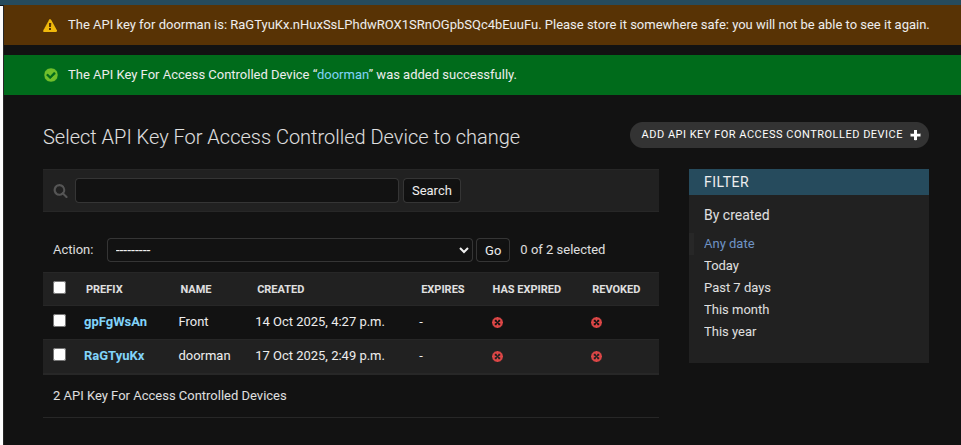

# doorman
A solution for connecting the Fanvil i31s (or compatible) line of door phones to LDAP for access control.
Also supports the [MemberMatters](https://github.com/membermatters/MemberMatters) door controller protocol, with optional
fallback to LDAP.

# Quickstart

Required:
 * python 3.9+

Suggested:
 * [direnv](https://direnv.net/docs/installation.html)

```sh
# Create virtual environment
python3 -m venv venv
source venv/bin/activate

# Install dependancies
pip install -r requirements.txt

# Edit configuration template:
cp envrc.example .envrc

# Pre-commit hooks (for development)
pip install pre-commit && pre-commit install

FLASK_APP=doorman FLASK_ENV=development flask run --host=0.0.0.0
```

# Deploy with Docker

```sh
# 1. Build the image:
docker build -t doorman .

# 2. Put the environment variables from envrc.example in .env
cp envrc.example .env

# 3. Edit your config to suit

# 4. Run the webserver with:
docker run -d -p 5000:80 --name=doorman --env-file=.env -v ./mm-doorman.json:/tmp/mm-doorman.json doorman:latest

# 5. For use with Member Matters, run the websocket client:
docker run -d --name=doorman_ws --env-file=.env -v ./mm-doorman.json:/tmp/mm-doorman.json doorman:latest python3 websocket_client.py
```

# Configure for use with MemberMatters

## Add API key for access control device

1. In the MemberMatters Django Admin (`/admin` URL), navigate to **Access** > **API Key for Access Controlled Devices**, and click **Add**.
2. Give your connector an unique name less than 50 characters.  Set that same name for `DOORMAN_MM_DEVICE_NAME` variable for doorman.
3. Optionally set an expiration date for the key.  Click **Save**.
4. The API key will be flashed at the top of the screen in an orange box.  Use that value for `DOORMAN_MM_API_KEY`.



## Enable the connector device

1. Run `websocket_client.py`.  Doorman will try to register with the server, but the server will disconnect the connector until it is authorized.
2. In the Django Admin, click on **Access** > **Doors**, then click `New Device (doorman)` (the value in perens will match `DOORMAN_MM_DEVICE_NAME` from earlier).
3. Check `Is this device authorised to access the system?`, and set any of the option checkboxes according to your setup, and click **Save**.